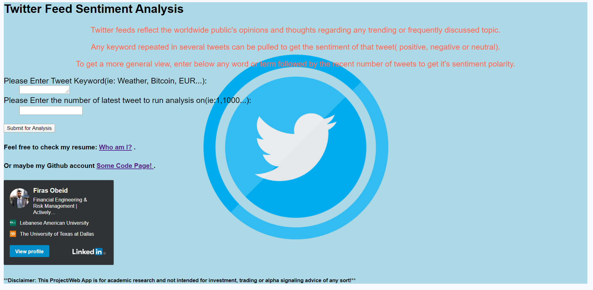
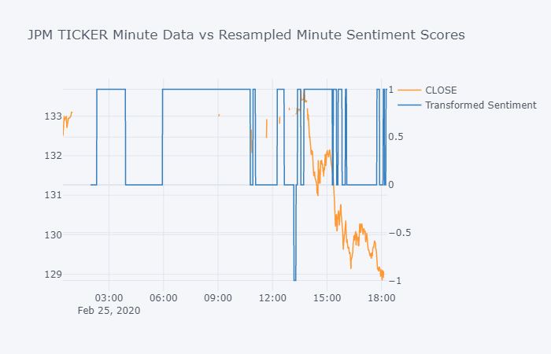

# My Sentiment Analysis Methods

Senitment Analysis using several data sources:
- Sentiment polarity from scrapping tweets from Twitter that have a specfic keyword menttioned in them.

- Scoring live feed articles pulled from Eikon App (Reuters) and comparing to any securities minute closing price.

___
Checkout the deployed Web App: http://firobeid.pythonanywhere.com/
___
